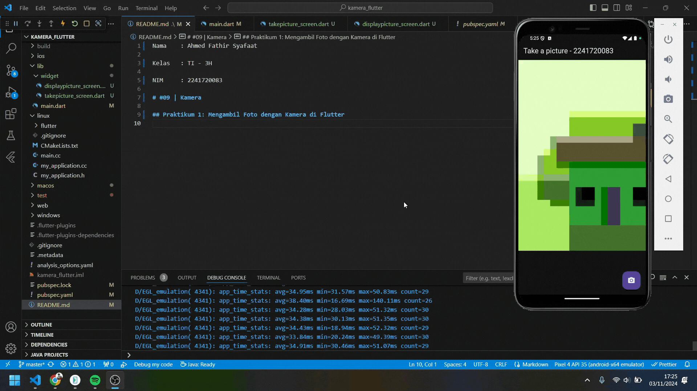

Nama    : Ahmed Fathir Syafaat

Kelas   : TI - 3H

NIM     : 2241720083

# #09 | Kamera

## Praktikum 1: Mengambil Foto dengan Kamera di Flutter

Terdapat di repository lain [kamera_flutter](https://github.com/Fyodor-DOs/kamera_flutter)

## Praktikum 2: Membuat photo filter carousel

## Tugas Praktikum
1. Selesaikan Praktikum 1 dan 2, lalu dokumentasikan dan push ke repository Anda berupa screenshot setiap hasil pekerjaan beserta penjelasannya di file README.md! Jika terdapat error atau kode yang tidak dapat berjalan, silakan Anda perbaiki sesuai tujuan aplikasi dibuat!

> - [Praktikum 1: Mengambil Foto dengan Kamera di Flutter](https://github.com/Fyodor-DOs/kamera_flutter)
> - [Praktikum 2: Membuat photo filter carousel](https://github.com/Fyodor-DOs/kamera_flutter)

2. Gabungkan hasil praktikum 1 dengan hasil praktikum 2 sehingga setelah melakukan pengambilan foto, dapat dibuat filter carouselnya!

3. Jelaskan maksud void async pada praktikum 1?

> - void: Merupakan tipe return dari fungsi. Ketika fungsi dideklarasikan sebagai void, fungsi tersebut tidak mengembalikan nilai apapun.
> - async: Merupakan fungsi asynchronous, yang berarti fungsi ini dapat melakukan operasi secara paralel atau menunggu operasi lain selesai tanpa menghentikan eksekusi kode utama.

4. Jelaskan fungsi dari anotasi @immutable dan @override ?

> - @immutable: Merupakan objek dari class tersebut tidak bisa diubah setelah dibuat. Umumnya digunakan untuk widget yang tetap.
> - @override: Merupakan metode yang menggantikan atau meng-override method di class induk, membantu menjaga konsistensi dan menghindari kesalahan.

5. Kumpulkan link commit repository GitHub Anda kepada dosen yang telah disepakati!
